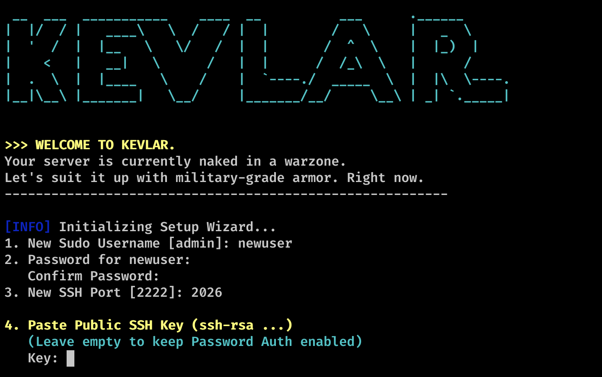

# 🛡️ KEVLAR - Advanced Linux Server Hardening

   

> **"Turn your fresh Linux VPS into a fortress in less than 2 minutes."**



**Kevlar** is an advanced, production-ready Bash script designed to automate the security hardening process of Ubuntu and Debian servers. It transforms a default, vulnerable installation into a secure, stable, and production-ready environment using industry best practices.

Unlike basic scripts, Kevlar includes **Smart Swap creation**, **Centralized Configuration Backups**, **NTP Time Sync**, and **SSH Key Injection**.

---

## 🚀 Key Features

* **🔐 Identity Management:** Creates a sudo user, imports SSH keys, and **locks the root account** completely.
* **🛡️ SSH Hardening:** Changes default port, disables password auth (if key provided), enforces Protocol 2, and removes banner info.
* **🔥 Smart Firewall:** Configures **UFW** to deny all incoming traffic except SSH and Web (80/443).
* **🤖 Intrusion Prevention:** Installs and tunes **Fail2Ban** to block brute-force attacks immediately.
* **🧠 Stability Engine:** Automatically detects low RAM (<2GB) and creates a **Swap file** to prevent OOM crashes during updates.
* **💾 Safety First:** Backs up every config file it touches to a centralized directory (`/root/kevlar_backups_TIMESTAMP`).
* **🌐 Network Stack:** Hardens `sysctl` against IP Spoofing, SYN Floods, and ICMP redirects.
* **⏱️ Precision:** Syncs system time via **NTP** (UTC) for accurate logging and audit trails.
* **🧹 Bloatware Removal:** Purges insecure legacy packages like Telnet, FTP, and Xinetd.

---

## 📦 Installation

**Requirements:**
* **OS:** Ubuntu 20.04+, Debian 11+
* **User:** Root (Fresh installation recommended)

Run the following command:

```bash
wget -qO kevlar.sh https://raw.githubusercontent.com/abdozkaya/kevlar/main/kevlar.sh && chmod +x kevlar.sh && ./kevlar.sh
```
---

## ⚙️ Usage & Configuration

When you run the script, the interactive wizard will guide you:

### 1. Configuration Inputs
* **Username:** The new sudo user (replaces root).
* **Password:** A strong password for the new user.
* **SSH Port:** Choose a custom port (e.g., `2024`) to avoid mass scanners.
* **SSH Key (Optional):** Paste your **Public Key** (starts with `ssh-rsa` or `ssh-ed25519`).
    * *If provided:* Password authentication is **DISABLED** instantly (Maximum Security).
    * *If skipped:* Password authentication remains enabled so you don't get locked out.

### 2. Execution Modes
* **[1] AUTOMATIC (Default):** Runs all hardening tasks sequentially without interruption. Best for quick provisioning.
* **[2] MANUAL:** Asks for confirmation before every single step. Best for learning or auditing the process.

---

## 🔍 Under the Hood

Here is exactly what Kevlar modifies on your system:

| Category | Actions Performed |
| :--- | :--- |
| **System** | `apt update/upgrade`, Install tools (`auditd`, `rkhunter`, `vim`, `curl`), Enable Unattended Upgrades. |
| **User** | Create sudo user, `passwd -l root`, restrict home dir permissions (`chmod 750`). |
| **SSH** | Custom Port, Protocol 2, Disable Root Login, MaxAuthTries 3, **Banner Warning**. |
| **Network** | Disable IP Forwarding, Ignore ICMP Broadcasts, Enable TCP Syncookies, Log Martians. |
| **Firewall** | UFW Reset, Default Deny Incoming, Allow SSH/HTTP/HTTPS. |
| **Security** | Configure Fail2Ban (SSHD Jail), Secure Shared Memory (`/dev/shm` noexec). |
| **Stability** | **Smart Swap:** Checks RAM -> Creates 1GB Swap if RAM < 2GB. Sets Timezone to UTC. |
| **Backups** | Original configs saved to `/root/kevlar_backups_YYYY-MM-DD_HH-MM-SS`. |

---

## ⚠️ Important Post-Install Step

Once the script finishes, **DO NOT CLOSE YOUR TERMINAL**.

1.  Open a **NEW** terminal window.
2.  Test the connection using your new user and port:
    ```bash
    ssh -p <YOUR_PORT> <NEW_USER>@<SERVER_IP>
    ```
3.  Only close the original session once you confirm access.

---

## 🤝 Contributing

Contributions are welcome! Please fork the repository and submit a pull request for any enhancements or bug fixes.

1.  Fork the Project
2.  Create your Feature Branch (`git checkout -b feature/AmazingFeature`)
3.  Commit your Changes (`git commit -m 'Add some AmazingFeature'`)
4.  Push to the Branch (`git push origin feature/AmazingFeature`)
5.  Open a Pull Request

## 📄 License

Distributed under the MIT License. See `LICENSE` for more information.

---
*Disclaimer: This script is provided "as is", without warranty of any kind. Use it at your own risk. Always backup your data before running system administration scripts.*
